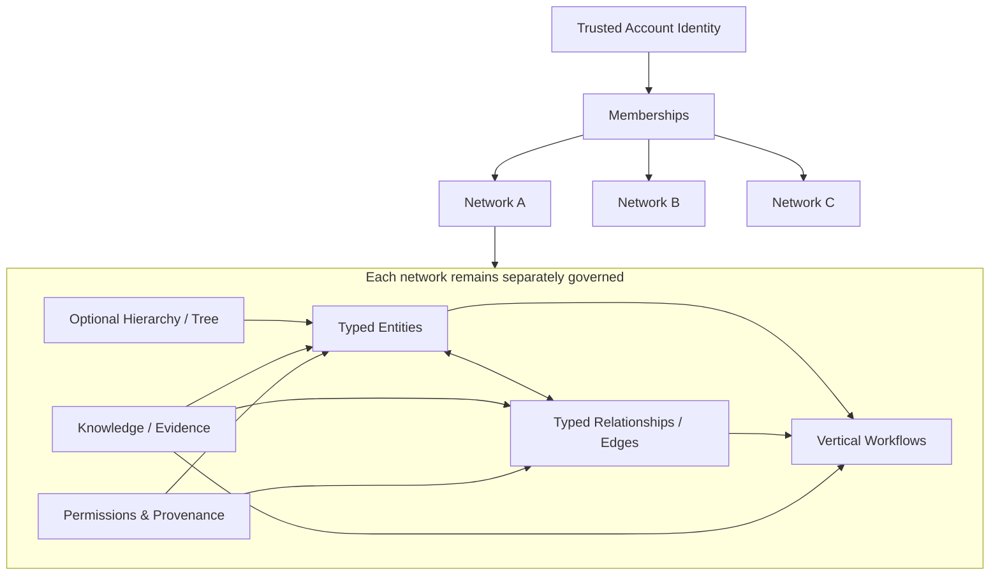
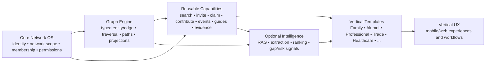
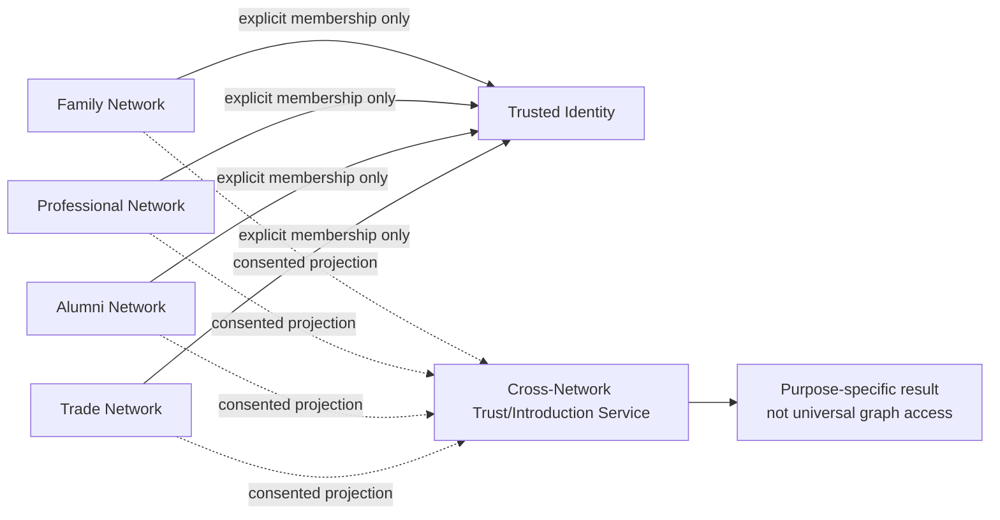

# Generic Network OS — Graph / Interconnected Network Platform Architecture

**Updated:** 2026-08-27  
**Purpose:** guide future graph-shaped verticals without turning the product into one universal public graph.

## 1. Architectural thesis

The current tree/hierarchy capability is a special case of a broader model:

> **typed entities + typed edges + network scope + membership/trust + evidence + permissions + actions.**

Trees remain important where parent/child structure is authoritative. New verticals may combine hierarchy with many-to-many graph relationships.

## 2. Conceptual architecture



## 3. Platform layering



The intelligence layer is optional. Canonical graph truth remains permissioned and governed.

## 4. Example graph-shaped domains

### Professional network
Person → MEMBER_OF → Association  
Person → SPECIALIZES_IN → Specialty  
Person → WORKS_AT → Practice/Firm  
Person → REFERRED_BY → Person  
Person → COLLABORATED_WITH → Person  
CaseStudy → DEMONSTRATES → Expertise

### Healthcare provider ecosystem
HospitalGroup → CONTAINS → Hospital  
Hospital → HAS_DEPARTMENT → Department  
Specialist → PRACTICES_AT → Facility  
Specialist → SPECIALIZES_IN → Specialty  
Facility → HAS_CAPABILITY → Service/Equipment  
Hospital → REFERS_TO → Hospital/Specialist

### Industry/trade ecosystem
Company → SUPPLIES → Company  
Company → CERTIFIED_FOR → Capability  
Company → MEMBER_OF → Association  
Project → USED_VENDOR → Company  
Person → REPRESENTS → Company  
Company → DEPENDS_ON → Supplier/Capability

## 5. Cross-network architecture



Cross-network capability must exchange **purpose-limited projections**, not raw network graphs.

## 6. Reuse model for future verticals

Target roughly:
- **30–50% shared platform/core capabilities**;
- **10–25% reusable ancestor/domain capability packs**;
- **25–60% vertical-specific semantics/workflows/UX**, depending on the domain.

These are design ranges, not targets to force. Reuse is valuable only when semantics remain correct.

## 7. RAG / LLM role

For graph-centric verticals, RAG can become a powerful companion:

**Authorized knowledge → evidence extraction → candidate entities/relationships → governed review → graph → graph-aware retrieval → action.**

Examples:
- “Which hospital in our group has experience with this operational issue?”
- “Which lawyer in the network has evidence-backed expertise in this jurisdiction/topic?”
- “Which supplier has previously solved this manufacturing constraint for a trusted member?”
- “Who owns this dependency and what decisions led here?”

The LLM should not silently convert text into trusted canonical relationships.

## 8. Technical evolution / debt checkpoint

Create a recurring architecture review after meaningful milestones rather than continuously refactoring.

Review these buckets:
1. **Domain/UI separation** — business logic trapped in components.
2. **Graph generality** — tree assumptions blocking typed many-to-many edges.
3. **API/mobile portability** — web-only dependencies.
4. **I18N completeness** — untranslated literals and locale coupling.
5. **Design-system consistency** — duplicated layout/theme primitives.
6. **Permission/RLS drift** — inconsistent authorization between capabilities.
7. **Performance/scalability** — large graph rendering, search, caching, pagination.
8. **Data model/versioning** — backward-compatible edge/entity evolution.
9. **Observability** — network activation, outcome and failure diagnostics.
10. **Evidence/intelligence isolation** — optional AI remains decoupled from canonical operations.

Do not turn this into a permanent refactor project. Prioritize debt only when it blocks product quality, security, scale, mobile portability or a validated vertical.


## 2026-08-29 — Capability delivery is a separate architecture dimension
A feature has three independent states: **entitlement/rollout**, **code/dependency delivery**, and **backend/runtime activation**. Hiding a feature is insufficient if its large UI/dependencies still ship or its RPC/subscription/job activity still runs. CR-1 begins by dynamically importing advanced My Networks modules. Future capability manifests should declare lazy UI entrypoints, dependencies, authorization, backend activation and telemetry. Dynamic loading never replaces server authorization/RLS.

## Future composable network-type architecture
The six current verticals are reference implementations. After their primitives stabilize, extract a versioned Network Type Manifest covering terminology, entities, relationships, projections, fields, modules, navigation, workflows, roles and application/federation scopes. A governed Network Type Studio can then create hundreds of network products from safe declarative composition instead of adding hard-coded verticals.

## NF-3 federation runtime read model — 2026-08-29
```text
Umbrella Admin
     │
     ▼
approved Network↔Umbrella affiliations
     │
     ├── Network identity / vertical / affiliation metadata
     │
     └── currently permitted Network Passport projection
             │
             ▼
      Umbrella Network Runtime
      - network participant directory
      - affiliation health
      - Passport readiness/freshness
      - vertical/capability/scope aggregates
```

**Forbidden shortcut:** `Umbrella → child network_memberships / profiles / relationships`.

The NF-3 read model is intentionally derived and privacy-minimal. A Network Passport becoming Private removes its outward fields from the runtime at the next read without requiring affiliation deletion.

## NF-4 federated discovery read model — 2026-08-29
Eligibility is computed at read time from four independent facts: (1) requester has an active membership in a source network; (2) source network has an approved affiliation to an active umbrella; (3) target network has an approved affiliation to the same umbrella; (4) target Network Passport is Federation/Public and directory-discoverable. The result contains Network Passport fields plus institutional provenance only.

Purpose filtering is metadata-level filtering over target-network declared capabilities/scopes. It is **not** a participant authorization mechanism. Any future person/resource projection must add a separate application-scope + eligibility + consent layer before returning those entities.

## NF-5 consent graph extension
The governed graph now adds a separate purpose-consent edge:
`Person/User → [source Network + Umbrella + Purpose] → selective outward scope profile`.
This edge is independently revocable and is never derived from Person↔Network membership, Network↔Umbrella affiliation or Network Passport purpose declarations. Federated participant discovery may return only active scope snapshots reachable through an approved umbrella path.
