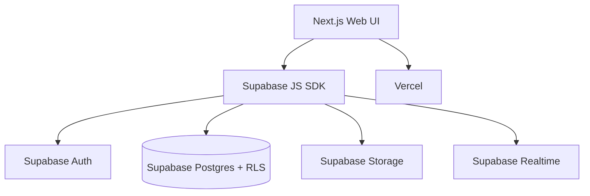
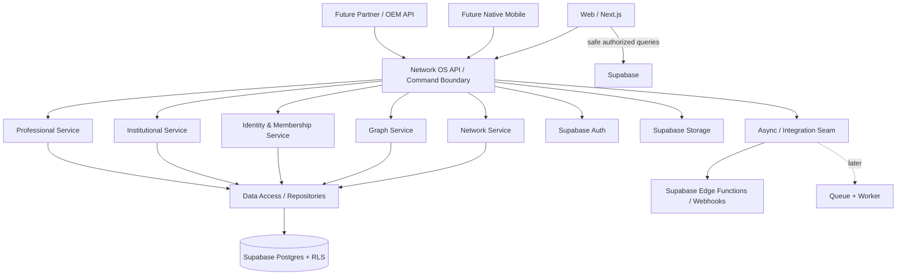
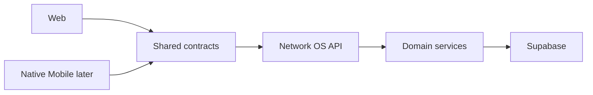

# Network OS Backend & Runtime Architecture

**Decision date:** 2026-08-27  
**Status:** APPROVED DIRECTION — IMPLEMENT IN MISSION 4  
**Recommended effort:** MEDIUM

## Why this exists

Generic Network OS has successfully reached a large product surface using Next.js + Supabase + Vercel. That is not a missing backend: Supabase already provides Postgres, Auth, Storage, Realtime, RLS and generated data APIs, while Vercel provides web/serverless hosting. The missing maturity layer is an **application-owned server boundary** for business commands, orchestration, integrations, auditability, mobile clients and future AI workloads.

Do not react by creating microservices or replacing Supabase. Mission 4 should introduce one modular TypeScript backend boundary while preserving the current working product.

## Current architecture



This remains valid for safe, RLS-protected reads and simple CRUD.

## Target architecture



## Technology stack

### Keep
- **Frontend:** Next.js 14, React 18, TypeScript.
- **Hosting:** Vercel.
- **Primary database:** Supabase Postgres.
- **Authentication:** Supabase Auth.
- **Authorization:** RLS remains the final data-security boundary.
- **Storage:** Supabase Storage.
- **Realtime:** Supabase Realtime where the product actually benefits.

### Add in Mission 4
- **Application backend:** Next.js Route Handlers + server-only TypeScript modules running on the Node.js runtime.
- **API style:** versioned REST-like `/api/v1/...` command endpoints. Avoid GraphQL and microservices for now.
- **Service layer:** modular `server/` packages for network, graph, identity/membership, institutional and professional domains.
- **Validation:** schema validation at API boundaries. Prefer a small typed validator such as Zod if introduced; keep it isolated and justified.
- **Data access:** server-side Supabase client/repository adapters; do not scatter privileged Supabase calls through UI components.
- **Contracts:** UI-independent TypeScript request/response/domain contracts reusable by future native mobile.
- **Observability seam:** request/correlation ID, actor, network, command, result, duration and sanitized error metadata.
- **CI:** GitHub Actions for install, directive/i18n/source gates, type/build, and later tests/security checks.

### Use selectively
- **Supabase Edge Functions:** webhooks, lightweight third-party integrations, event-triggered work and bounded background tasks. They are not the primary domain backend.
- **Postgres RPC/functions:** keep where data-local atomic logic is materially better; wrap important business commands behind the application service when practical.
- **Direct browser → Supabase:** retain for safe RLS-protected queries and simple low-risk writes where there is no orchestration/business-policy need.

### Do not add yet
- Kubernetes.
- Kafka.
- A fleet of microservices.
- Redis without measured cache pressure.
- Neo4j/Neptune without graph benchmarks proving Postgres insufficient.
- Elasticsearch/OpenSearch without validated search requirements.
- A separate Java/.NET/Go backend merely to look enterprise-grade.

## Command vs query rule

Use a CQRS-lite rule, not full CQRS infrastructure.

### Safe direct query
Browser may query Supabase directly when:
1. RLS fully defines access;
2. operation is read-oriented or trivial CRUD;
3. no secret/privileged credential is needed;
4. no multi-step invariant or external side effect exists.

### Server command required
Route through Network OS server when an operation includes one or more of:
- multi-step business workflow;
- privileged/service-role access;
- graph governance rules;
- identity claiming/linking;
- institutional bulk bootstrap;
- cross-network behavior;
- trusted introduction/referral workflow;
- third-party integration;
- notification/email orchestration;
- AI/RAG orchestration;
- audit/compliance requirement;
- rate limiting/idempotency requirement.

## Initial server structure

```text
server/
  shared/
    auth-context.ts
    errors.ts
    request-context.ts
    result.ts
  network/
    service.ts
    repository.ts
  graph/
    service.ts
    repository.ts
  identity/
    service.ts
    repository.ts
  membership/
    service.ts
    repository.ts
  institutional/
    service.ts
    repository.ts
  professional/
    service.ts
    repository.ts

app/api/v1/
  networks/
  memberships/
  graph/
  institutional/
```

Names are directional, not a requirement to create every file on day one.

## First commands to extract

Mission 4 should prove the pattern with only a small set of high-value commands:

1. `createNetwork`
2. `joinNetwork`
3. `createGraphRelationship`
4. `bootstrapInstitution`
5. `claimIdentity` or the safest existing claiming seam

Do not migrate every existing Supabase call.

## Mobile consequence

The backend boundary is also the mobile-enablement boundary:



Mobile should consume the same business commands instead of reimplementing browser orchestration.

## Scaling evolution

### Now
Vercel + Next.js + Supabase.

### When bulk/async workloads appear
Add a queue/worker seam for imports, invitations, enrichment, embeddings, digest generation and recalculation. Prefer managed/simple infrastructure first.

### When measured read pressure appears
Introduce caching/materialized projections only for proven hotspots.

### When graph traversal becomes a measured bottleneck
Benchmark Postgres recursive queries/indexing/materialized graph projections before evaluating a dedicated graph database.

## Security principles

- RLS remains mandatory; server APIs do not replace RLS.
- Never expose service-role credentials to browser/mobile.
- Server derives actor/network context from authenticated identity, not trusted client fields.
- Commands validate network scope and role explicitly.
- Sensitive errors are normalized before reaching clients.
- Cross-network operations remain deny-by-default until an explicit future Network Effect mission.

## Definition of success

Mission 4 succeeds if Network OS gains a reusable server/application boundary **without destabilizing existing verticals**, and at least 3–5 important commands demonstrate the pattern end-to-end. It does not succeed by maximizing backend code or infrastructure count.

## Mission 4 implementation status — 2026-08-27

The approved direction is now source implemented with a deliberately small command surface. `/api/v1` owns five representative commands while direct RLS-protected browser queries remain supported. The server authenticates with the caller's Supabase JWT and anon key rather than a service-role key, preserving RLS as the final security boundary.

The implemented server is modular but remains one deployable Next.js application. This is intentional: it creates future extraction seams without introducing microservice operational cost.


## Mission 5 production-runtime layer — 2026-08-28
Mission 5 standardizes every current `/api/v1` write behind a shared command runtime. It adds bounded request parsing, command burst protection, durable authenticated idempotency for network creation and institutional bootstrap, health/readiness probes, centralized runtime config, stronger structured logs and a future background-job contract.

The burst guard is deliberately instance-local; it is not global rate limiting. The background dispatcher deliberately refuses durable work because no queue/worker exists yet. These are honest seams rather than simulated production infrastructure. Add shared limiting or managed workers only when traffic, integrations or processing duration prove the need.


## M6-B — Trusted Network-to-Network Linking & Governed Bridges
M6-B extends M6-A/NX-1 with an explicit neutral graph of networks. Administrators exchange private Bridge Codes, request a typed relationship, propose future discovery/introduction capability intent, and the receiving network administrator must accept or decline. Either side can revoke an accepted bridge. The bridge itself exposes no cross-network members, profiles, relationships, activity or graph data; capability intent remains inert until M6-C. All writes use the M4/M5 application command runtime. Migration: `058_m6b_network_trust_bridges.sql`.
